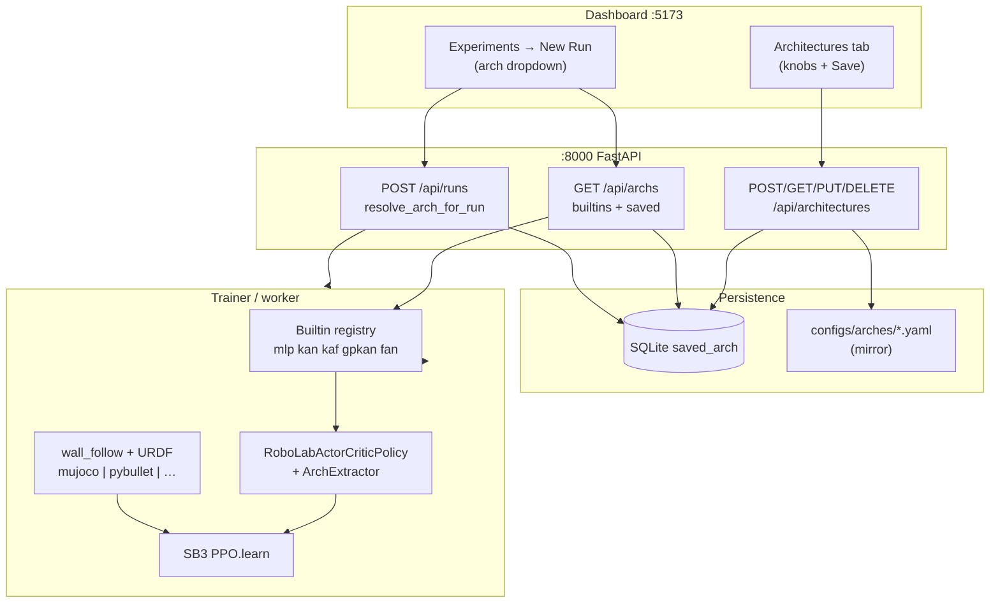

# Architecture Builder → wall_follow (diagram)

How a named architecture reaches PPO training on `wall_follow`.

## Mermaid



## ASCII

```
[Architectures UI] --POST--> [saved_arch SQLite] --yaml--> configs/arches/
         |                            ^
         v                            |
[New Run dropdown] <---- GET /api/archs
         |
         v
[POST /api/runs] --resolve--> arch=base_arch, arch_cfg=…
         |
         v
[trainer] -> get_arch(base) -> RoboLabActorCriticPolicy
         |
         v
[wall_follow env] <-> PPO.learn (local | RunPod)
```

## Builtin paper arches

| Name | Module | Source |
|---|---|---|
| `kaf` | `robolab/archs/kaf.py` | arXiv:2502.06018 (main) |
| `fan` | `robolab/archs/fan.py` | Dong et al. arXiv:2410.02675 |
| `gpkan` | `robolab/archs/gpkan.py` | RBF–KAN for GPKAN baseline |
